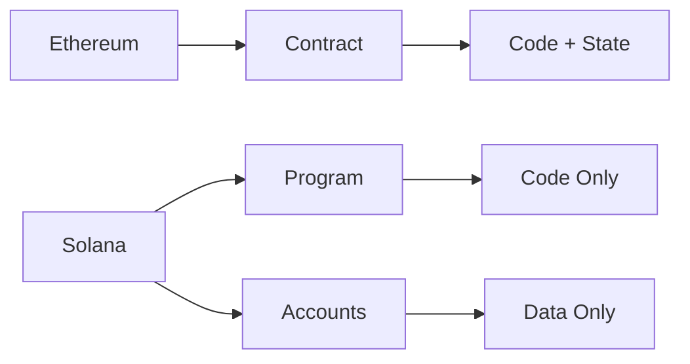
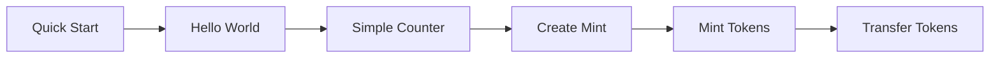

# Quick Start: 10 Minutes to Your First Solana Program

**Welcome, Solidity developer!** This guide gets you running with Solana/Anchor in under 10 minutes.

---

## Before You Start

### Prerequisites

This project is tested on **WSL2/Ubuntu only**. macOS support is planned but not currently tested.

### Version Check

Verify you have the correct versions installed:

```bash
rustc --version    # Should be 1.93.0
solana --version   # Should be 3.1.8
anchor --version   # Should be 0.32.1
```

**If versions don't match:** See [CLAUDE.md](../CLAUDE.md) for installation instructions.

---

## Run the Counter Test

In your project directory:

```bash
# Run the tests (starts local validator automatically)
anchor test
```

**Expected output:**
```
✔ Initializes the program
✔ Creates and increments a counter
```

**Success!** You just:
- Deployed a Solana program to a local validator
- Created a counter account using a PDA (Program Derived Address)
- Incremented that counter

---

## What Just Happened?

### The Account Model (Key Difference from Solidity)

In **Solidity/Ethereum**:
- State lives **inside** the smart contract
- One address = code + data combined

In **Solana**:
- State lives in **separate accounts**
- Programs (code) are stateless
- PDAs create deterministic addresses for program-owned accounts



### Your Counter Test

The test created a **Counter account** at a PDA derived from `["counter"]` seed:

```rust
// From programs/anchortokenstarter/src/lib.rs
#[account(
    init_if_needed,
    payer = payer,
    space = 8 + Counter::INIT_SPACE,
    seeds = [b"counter"],
    bump
)]
pub counter: Account<'info, Counter>,
```

**Key concept:** The `seeds = [b"counter"]` means the address is deterministically derived from your program ID and the string "counter". Same program + same seed = same address, always.

---

## Next Steps

You're ready to learn the patterns! Here's your learning path:



**Recommended:** Continue to [Pattern: Hello World](patterns/initialization/hello-world.md) to understand program structure.

**Or jump ahead:** Explore patterns by category:
- [Initialization Patterns](patterns/initialization/README.md)
- [Token Operations](patterns/token-operations/README.md)
- [Cross-Program Calls](patterns/cross-program-calls/README.md)
- [Security Patterns](patterns/security/README.md)

---

## If Tests Fail

### "command not found: anchor"
**Solution:** Install Anchor CLI. See [CLAUDE.md](../CLAUDE.md#installation).

### "Account already exists"
**Explanation:** The counter account was created in a previous run.

**Solution:** Reset the local validator:
```bash
# Terminal 1: Stop any running validator (Ctrl+C)
# Terminal 1: Start fresh validator
solana-test-validator --reset --ledger /tmp/test-ledger

# Terminal 2: Re-run tests
anchor test --skip-local
```

### Build errors
**Solution:** Ensure you're using Rust 1.93.0:
```bash
rustc --version
# If not 1.93.0, see CLAUDE.md for Rust setup
```

### "Failed to load program"
**Solution:** Rebuild the program:
```bash
anchor build
anchor test
```

---

## Common Gotchas for Solidity Developers

1. **No `msg.sender`**: Accounts are explicitly validated in structs, not implicit
2. **Rent exemption**: Accounts must hold minimum SOL to exist (unlike Ethereum storage)
3. **PDAs**: Programs can "sign" for derived addresses using seeds (no private key!)
4. **Transactions**: Explicitly list every account needed, even if not modified

**Deep dive:** See [Account Model](concepts/account-model.md) for full explanation.

---

## What You've Learned

- ✅ How to run Solana tests locally
- ✅ The difference between programs and accounts
- ✅ What a PDA (Program Derived Address) is
- ✅ Basic Anchor account constraints

---

## You Are Here

```
[Quick Start] ← You are here
      ↓
[Hello World] → Understanding program structure
      ↓
[Simple Counter] → PDAs and state management
      ↓
[Create Mint] → SPL Token basics
      ↓
[Mint Tokens] → Cross-Program Invocations (CPI)
      ↓
[Transfer Tokens] → Multi-account validation
```

**Continue to:** [Pattern: Hello World](patterns/initialization/hello-world.md)
