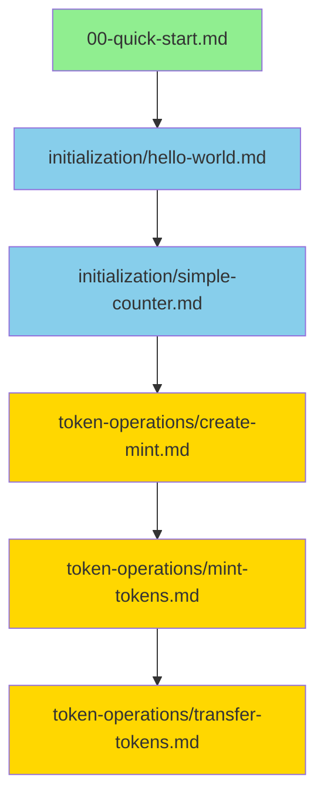

# Pattern Library

Referenceable patterns for common Solana/Anchor development tasks. Each pattern includes concept explanation, code examples, and runnable tests.

---

## How to Use This Library

**For learning:** Follow the [Learning Path](../00-quick-start.md#next-steps) in order.

**For reference:** Jump directly to the pattern you need.

**Pattern template:** Each page follows this structure:
- **Concept** - What and why
- **Code** - Annotated example
- **Running It** - How to test
- **If it fails** - Common errors and solutions

---

## Initialization Patterns

| Pattern | Concept | Difficulty |
|---------|---------|------------|
| [Hello World](initialization/hello-world.md) | Basic program structure | Beginner |
| [Simple Counter](initialization/simple-counter.md) | PDAs and state accounts | Beginner |
| [Config Account](initialization/config-account.md) | Multi-field state accounts | Intermediate (Exercise) |

---

## Token Operations

| Pattern | Concept | Difficulty |
|---------|---------|------------|
| [Create Mint](token-operations/create-mint.md) | SPL Token mint creation | Beginner |
| [Mint Tokens](token-operations/mint-tokens.md) | Minting to ATA, CPI | Intermediate |
| [Transfer Tokens](token-operations/transfer-tokens.md) | Multi-account validation | Intermediate |
| [Burn Tokens](token-operations/burn-tokens.md) | Burning tokens | Advanced (Exercise) |

---

## Cross-Program Calls (CPI)

| Pattern | Concept | Difficulty |
|---------|---------|------------|
| [CPI to Token Program](cross-program-calls/cpi-to-token.md) | Calling SPL Token | Intermediate |
| [CPI to System Program](cross-program-calls/cpi-to-system.md) | System program operations | Intermediate |

---

## Security Patterns

| Pattern | Concept | Difficulty |
|---------|---------|------------|
| [Signer Validation](security/signer-validation.md) | Authority checks | Intermediate |
| [Account Constraints](security/account-constraints.md) | Validation patterns | Intermediate |

---

## Learning Path

For a complete learning experience, follow this progression:



**Start here:** [Quick Start](../00-quick-start.md)

---

## Pattern Categories

### Initialization
Basic patterns for program setup and state management:
- **Hello World** - Understand program structure, logging
- **Simple Counter** - Learn PDAs, account initialization
- **Config Account** - Multi-field state (exercise)

### Token Operations
SPL Token patterns with ERC20 comparisons:
- **Create Mint** - Deploy a token mint (compare to ERC20 deployment)
- **Mint Tokens** - Mint to associated token accounts
- **Transfer Tokens** - Transfer between accounts

### Cross-Program Calls
Calling other programs from your program:
- **CPI to Token** - Invoke SPL Token program
- **CPI to System** - System program operations

### Security
Common security patterns:
- **Signer Validation** - Authority checks
- **Account Constraints** - Input validation

---

## Concept Deep-Dives

Each pattern links to related concept documentation:

- [Account Model](../concepts/account-model.md) - Data vs programs, rent exemption
- [PDAs Explained](../concepts/pdas-explained.md) - Program Derived Addresses in depth
- [Anchor Macros](../concepts/anchor-macros.md) - `#[account]` attributes reference
- [Rust Survival](../concepts/rust-survival.md) - Rust for Solidity developers

---

## Quick Reference

| You want to... | Go to pattern |
|----------------|---------------|
| Create a state account | [Simple Counter](initialization/simple-counter.md) |
| Deploy a token | [Create Mint](token-operations/create-mint.md) |
| Mint tokens to users | [Mint Tokens](token-operations/mint-tokens.md) |
| Transfer tokens | [Transfer Tokens](token-operations/transfer-tokens.md) |
| Call another program | [CPI to Token](cross-program-calls/cpi-to-token.md) |
| Validate authority | [Signer Validation](security/signer-validation.md) |

---

## Exercises

Patterns marked as **(Exercise)** are incomplete implementations for you to finish:

- [Config Account](initialization/config-account.md) - Create a multi-field config account
- [Burn Tokens](token-operations/burn-tokens.md) - Implement token burning

These include:
- Problem description
- Implementation hints
- Expected test cases
- Solution (hidden)

---

## Contributing

Adding new patterns? Follow the [Pattern Template](#pattern-template) for consistency.

### Pattern Template

```markdown
## Pattern: [Name]

**Concept:** [What this pattern teaches]
**Related Code:** `programs/anchortokenstarter/src/lib.rs: <function_name>`
**Test:** `tests/anchortokenstarter.ts: <test_name>`
**Prerequisites:** [List any patterns or concepts to complete first]

### What You're Building
[Brief description]

### The Concept
[2-3 paragraph explanation]

### The Code
```rust
[Code snippet with inline comments]
```

### Running It
```bash
[Command]
```

**Expected output:** [What success looks like]

**If it fails:**
- `Error: ...` → [Explanation and fix]
- See [common-errors.md](../reference/common-errors.md)

### Solidity Sidebar
[Quick comparison - 2-3 sentences, only when essential]

### You've Learned
- [Skill 1]
- [Skill 2]

### Next Steps
- [Related pattern](../path/to/pattern.md)
```

---

## Need Help?

- **Troubleshooting:** See [Common Errors](../reference/common-errors.md)
- **Solidity comparison:** See [Solidity Cheat Sheet](../reference/solidity-comparison.md)
- **Concept questions:** See [Concepts](../concepts/)
